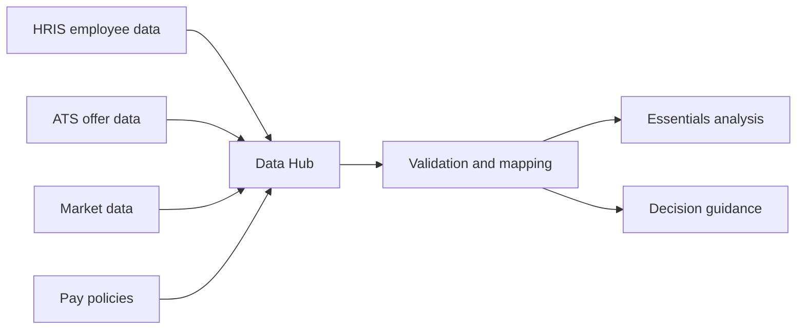

# Import compensation data

Data Hub brings employee, job, pay, and decision inputs into one governed foundation for analysis and recommendations.

## Required data families

| Data family | Examples | Review owner |
| --- | --- | --- |
| Employee | Worker ID, location, manager, job family | HR operations |
| Job | Level, role, function, grade, FLSA status | Compensation |
| Pay | Base, bonus, currency, effective date | Total rewards |
| Decisions | Offer, promotion, merit, transfer request | Talent and managers |


Do not use free-text job titles as the only grouping field. Map them to a normalized job architecture before running analysis.

