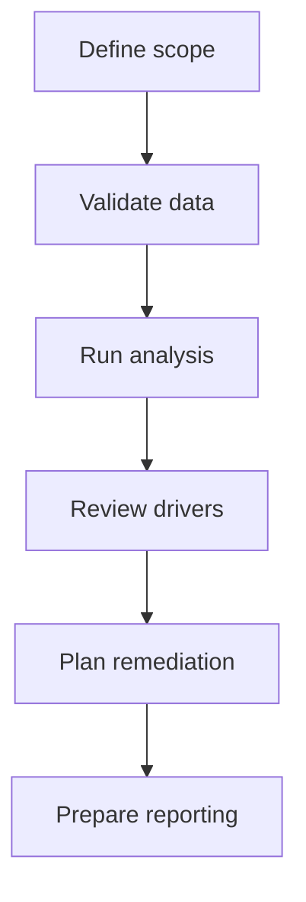

# Run pay equity analysis

Essentials gives compensation and legal teams a defensible view of pay equity across countries, job groups, and populations.


{% column width="50%" %}
## What the analysis answers

- Where statistically significant gaps appear.
- Which drivers explain pay differences.
- Which groups require remediation planning.
- Which records require additional review.


{% column width="50%" %}

Legal review should confirm scope, privilege assumptions, remediation notes, and external reporting language before broader distribution.




## Analysis stages

