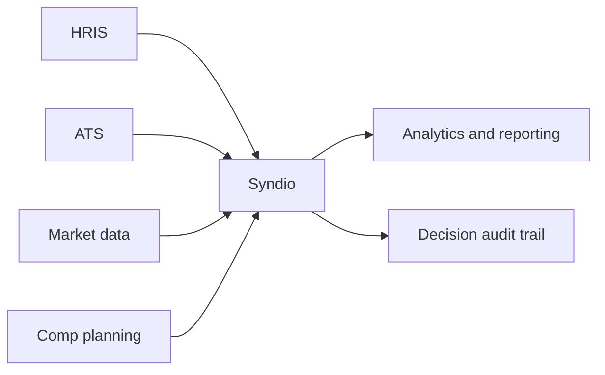

# Systems overview

Syndio sits between systems of record and the teams making pay decisions.

## Integration principles

- Keep employee, job, and pay data anchored to systems of record.
- Sync decision events close to the moment the decision is made.
- Preserve mapping rules, timestamps, and import results for auditability.
- Separate configuration access from day-to-day decision review access.
