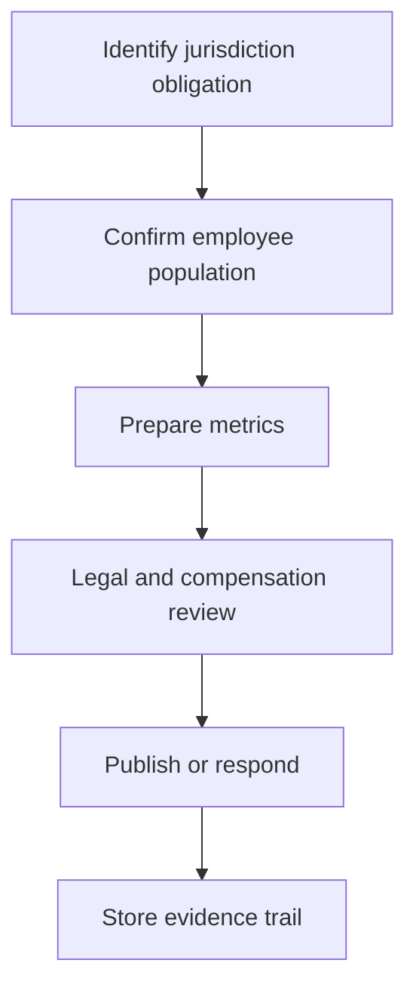

# Transparency compliance

Pay transparency readiness combines accurate data, repeatable analysis, approved language, and a durable evidence trail.

## What to document

- Reporting entity and jurisdiction.
- Population, exclusions, and compensation elements.
- Analysis date and data snapshot.
- Approved external language.
- Remediation actions and owners.
